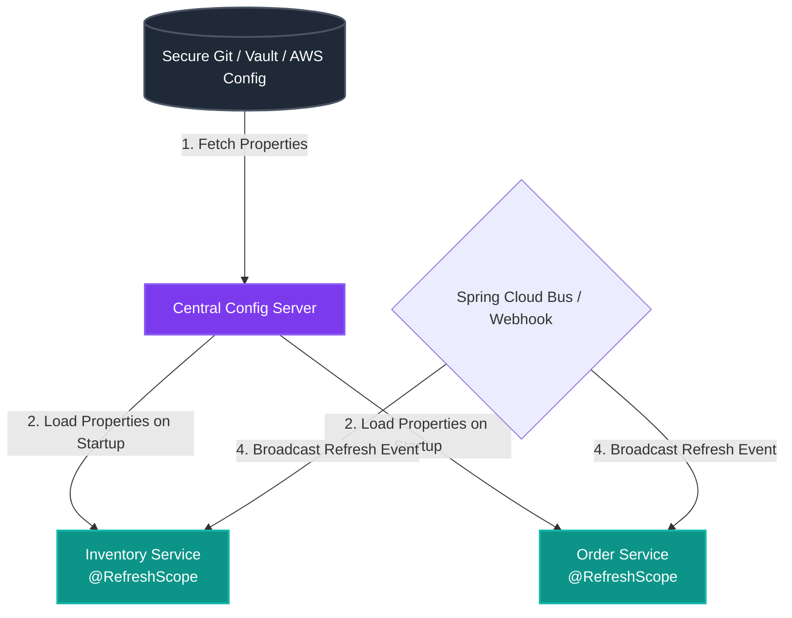
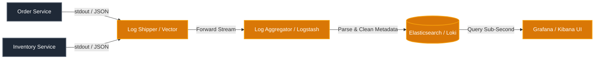
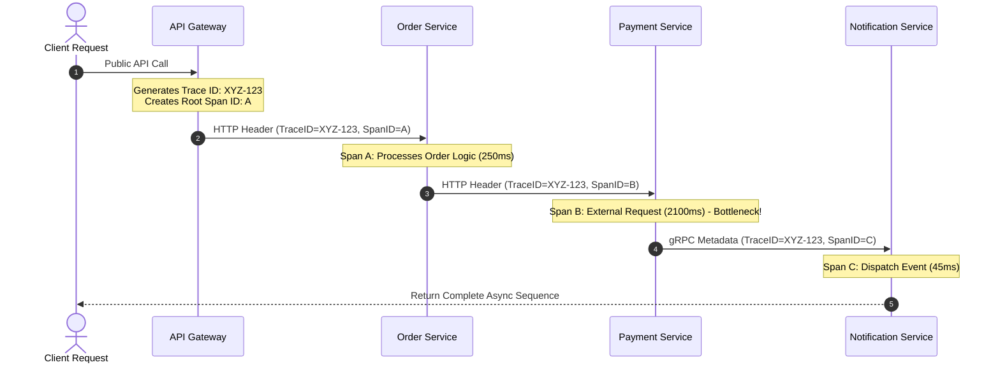
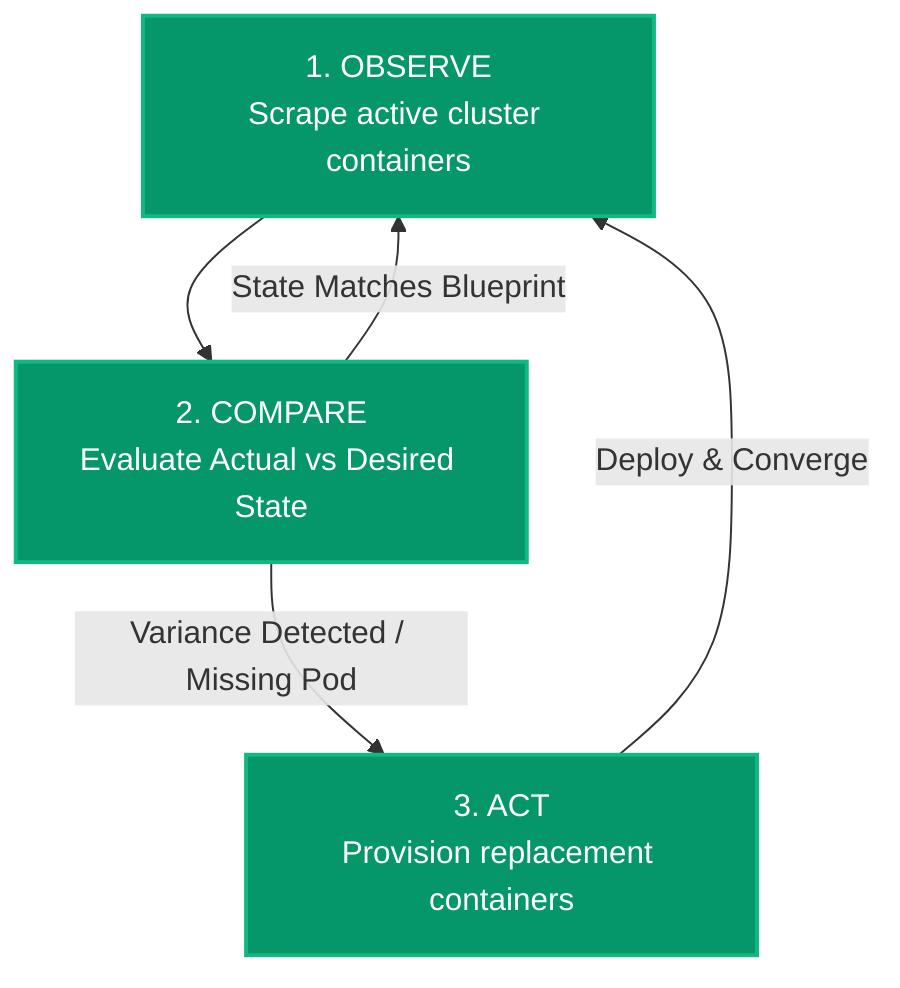
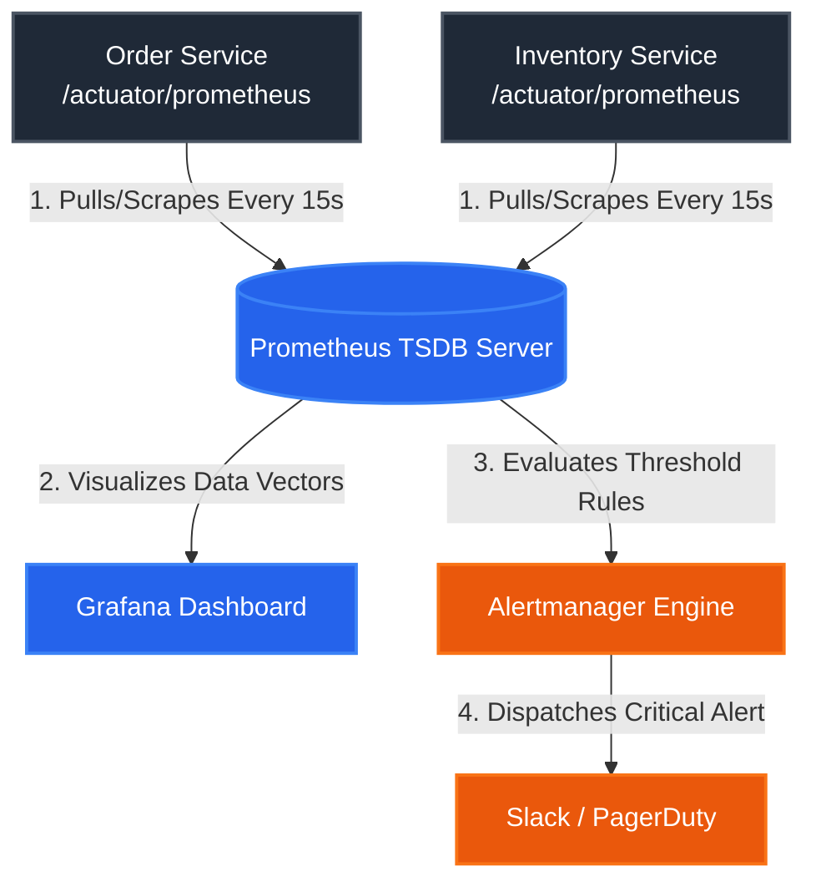

```mermaid
graph TD
    %% Styling Configuration
    classDef modelBox fill:#1f2937,stroke:#4b5563,stroke-width:2px,color:#fff;
    classDef activeBox fill:#0284c7,stroke:#0ea5e9,stroke-width:2px,color:#fff;
    classDef alertBox fill:#b91c1c,stroke:#ef4444,stroke-width:2px,color:#fff;

    subgraph Blocking Model ["Blocking / Imperative Model"]
        R1[Request 1] --> TA[Thread A]
        TA --> DB(Calls DB / Remote API)
        DB --> TS[Thread Blocks & Sleeps 5s]
        TS --> Resp1(Response)
        
        R2[Request 2] --> TB[Thread B]
        TB --> TS2[Thread Starvation / Waiting Pool]
    end

    subgraph Non-Blocking Model ["Non-Blocking / Reactive Model"]
        NR1[Request 1] --> EL[Event Loop Thread]
        EL --> OS(Dispatches I/O Task to OS Kernel)
        OS --> Free[Event Loop is INSTANTLY Freed]
        Free --> NR2[Handle Request 2, 3, 4...]
        
        OS -.->|OS Signals Task Complete| CB[Invoke Callback Context]
        CB --> Resp2(Response)
    end

    class TA,TB,TS,TS2 alertBox;
    class EL,OS,Free,CB activeBox;
```    

# Microservices Architecture Reference Guide

A comprehensive, production-ready reference guide detailing the architectural patterns, components, and communication protocols used in modern distributed systems.

---

## 🗺️ Architectural Roadmap

The following topics represent the core pillars of microservices system design covered in this reference documentation:

*   **1. Monolithic vs. Microservices Foundations**
*   **2. Service Discovery & Registry Patterns**
*   **3. API Gateway Architecture**
*   **4. Inter-Service Communication Frameworks**
*   **5. Fault Tolerance & Resilience Patterns**
*   **6. Centralized Configuration Management**
*   **7. Distributed Tracing & Observability**
*   **8. Distributed Data Management Patterns**

---

## 1. Monolithic vs. Microservices Foundations

### Monolithic Architecture
A **Monolithic Architecture** is a software design pattern where the entire application—including the user interface, business logic, and data access layers—is built, packaged, and deployed as a single, unified execution unit.

*   **Deployment:** Single artifact deployment (e.g., a single `.war` or `.jar` file).
*   **Scaling:** Scaled horizontally by replicating the entire monolith across multiple servers behind a load balancer.
*   **Data Domain:** Accesses a single, centralized relational database shared across all functional modules.

### Microservices Architecture
A **Microservices Architecture** is an architectural style that structures an application as a collection of small, autonomous, and loosely coupled services. Each service is organized around a specific business capability and runs as an independent process.

*   **Deployment:** Independent deployment cycles per service using automated CI/CD pipelines.
*   **Scaling:** Granular scaling; only the specific service experiencing high traffic is replicated.
*   **Data Domain:** Implements the *Database-per-Service* pattern to ensure strict data isolation and loose coupling.

---

### Architectural Comparison

| Architectural Attribute | Monolithic Architecture | Microservices Architecture |
| :--- | :--- | :--- |
| **Codebase Scope** | Single, large repository containing all domain modules. | Distributed repositories; one per autonomous service boundaries. |
| **Scalability** | All-or-nothing scaling. High resource overhead. | Targeted scaling based on distinct service resource needs. |
| **Fault Isolation** | Low. A memory leak or crash in one module takes down the entire application. | High. A failure in one service is contained without crashing the entire system. |
| **Technology Stack** | Single, uniform technology stack locked across the lifecycle. | Polyglot options. Services choose the optimal language/database for their specific domain. |
| **Data Consistency** | Strong consistency managed via local ACID transactions. | Eventual consistency managed via distributed saga patterns or events. |
| **Operational Complexity** | Low operational overhead initially; increases as the codebase scales. | High operational overhead. Requires robust containerization, service meshes, and automation. |

---

> **Design Principle Note:** Microservices are bound by **Bounded Contexts** (from Domain-Driven Design). A service should own its data and expose functionality only through well-defined, public APIs (REST, gRPC, or Message Brokers).

## 2. Core Microservices Design Patterns

### 1. Service Discovery Pattern
*   **Problem:** In cloud-native environments, service instances scale up, scale down, or crash frequently, resulting in dynamically shifting IP addresses and port numbers. Hardcoding these endpoints inside consumer configurations causes instant system failure when network routes change.
*   **Solution:** Implement a central **Service Registry** that acts as a dynamic database of all active service locations. When a service instance boots up, it self-registers its IP and port. Consumer services query this database at runtime to find target instances dynamically.

```text
       ┌───────────────────────────────┐
       │   Discovery Server / Registry │◀──────────────────────┐
       └───────────────────────────────┘                       │
             ▲                       ▲                         │
             │                       │                         │
     (1. Registration)       (2. Heartbeat)            (3. Instance Query)
   AppID: "Service-B"      "Still Alive!"             "Where is Service-B?"
   IP: 111.22.33.44         Every 30s                  Returns IP Array
   Port: 9090                │                                 │
             │               │                                 │
             ▼               ▼                                 ▼
       ┌───────────────────────────────┐               ┌───────────────────────┐
       │           Service-B           │               │       Service-A       │
       └───────────────────────────────┘               └───────────────────────┘
                                                           │
                                               (4. Client-Side Load Balance)
                                               Uses Round-Robin on cached IPs
                                                           │
                                                           ▼
                                               [ Hits Service-B Directly ]
```

#### Transaction Execution Flow
1.  **Registration:** `Service-B` spins up. It sends a REST payload containing its application ID, dynamic IP (`111.22.33.44`), and port (`9090`) to the **Discovery Service**.
2.  **Heartbeats:** `Service-B` continually sends small, automated ping packets to the registry every 30 seconds. If a heartbeat packet is missed twice consecutively, the registry assumes the instance has crashed and purges its record.
3.  **Discovery/Query:** When `Service-A` wants to execute a REST call to `Service-B`, it asks the Discovery Server: *"Where are the healthy instances for Service-B?"*
4.  **Client-Side Load Balancing:** The discovery server returns an array list of active instances. `Service-A` caches this list locally and applies a client-side routing algorithm (like Round-Robin) to hit the target instance directly.
*   **Industry Standards:** Netflix Eureka, HashiCorp Consul, Apache ZooKeeper.

---

### 2. Edge Server (API Gateway) Pattern
*   **Problem:** Exposing dozens of individual microservices directly to client applications creates major architectural friction. Clients must make multiple round-trip requests, manage complex cross-origin (CORS) rules, handle public authentication on every single endpoint, and manage changing service routes.
*   **Solution:** Deploy an **Edge Server / API Gateway** as the single entry point for all external traffic. It acts as a reverse proxy, routing incoming client requests to the appropriate downstream microservice, managing security filters globally, and load-balancing traffic.
*   **Key Responsibilities:** Reverse Proxying, Authentication/Authorization, Rate Limiting, CORS Configuration, Path Rewriting, Request/Response Transformation.

```text
[ Client / Browser ]          [ API Gateway ]             [ Microservices ]
          │                           │                            │
          │ ─── 1. HTTP Request ────► │                            │
          │    (e.g., /api/v1/orders) │                            │
          │                           │                            │
          │                           │ ── 2. Auth Filter ──┐      │
          │                           │    Validates JWT    │      │
          │                           │ ◄───────────────────┘      │
          │                           │                            │
          │                           │ ── 3. Rate Limiter ─┐      │
          │                           │    Checks Redis     │      │
          │                           │ ◄───────────────────┘      │
          │                           │                            │
          │                           │ ── 4. Path Rewrite ────────► [ Order Service ]
          │                           │    Forward to internal IP  │ (Internal Route)
          │                           │                            │
          │                           │ ◄── 5. JSON Response ──────┤
          │                           │                            │
          │ ◄── 6. Client Response ───│                            │
          │    (Unified Endpoint)     │                            │
```          
#### Request Execution Lifecycle

*   **1. Unified Entry Point:** The external client (web/mobile) sends a request exclusively to the public API Gateway endpoint, abstracting away the complex internal network infrastructure.
*   **2. Centralized Security Filter:** The Gateway acts as an immediate security boundary. It intercepts the request to parse and validate transport tokens (such as checking a JWT signature). Invalid requests are instantly rejected with an HTTP `401 Unauthorized` status.
*   **3. Rate Limiting Protection:** The request hits a token-bucket or leaky-bucket filter (backed by an in-memory database like Redis). If a client exceeds their allocated request threshold, the Gateway short-circuits the pipeline and returns an HTTP `429 Too Many Requests` response.
*   **4. Path Rewriting & Internal Routing:** Once validated, the Gateway rewrites the public URL syntax into an internal routing format and forwards the request down the corporate network to the appropriate isolated microservice cluster.
*   **5. Response Consolidation:** The downstream microservice handles the business logic, queries its dedicated database, and sends the raw payload back to the Gateway, which smoothly passes the clean HTTP response back to the client.
*   **Industry Tools:** Spring Cloud Gateway, Netflix Zuul (Legacy), Kong, AWS API Gateway, NGINX.

---

### 3. Reactive Microservices Pattern
*   **Problem:** Traditional microservices rely on synchronous thread-per-request blocking execution models (like Spring WebMVC). When a service calls another slow downstream service, the handling thread blocks and enters a waiting state. Under heavy traffic, thread pools exhaust rapidly, cascading latency across the system.
*   **Solution:** Build services on a **Reactive, Non-Blocking Framework** that utilizes asynchronous event loops. Threads do not block while waiting for data transformations or network I/O; they register a callback handler and are instantly freed to process other incoming requests.
*   **Key Attributes:** Responsive, Resilient, Elastic, Message-Driven (The Reactive Manifesto).

```text
[Blocking / Imperative Model]
Request 1 ──► [Thread A] ──► (Calls DB / Remote API) ──► [Thread Blocks/Sleeps (5s)] ──► Response
Request 2 ──► [Thread B] ──► [Waiting for available thread... Thread Starvation!]

[Non-Blocking / Reactive Model]
Request 1 ──► [Event Loop Thread] ──► (Dispatches I/O Task to OS) 
                                               │
               ┌───────────────────────────────┘
               ▼
       [Event Loop Thread is INSTANTLY freed to handle Request 2, 3, 4...]
               │
               ▼
       (OS Signals I/O Task Complete) ──► [Event Loop Thread invokes Callback] ──► Response
```

#### Request Execution Lifecycle

*   **1. Immediate Thread Release:** When an incoming HTTP request arrives at the reactive service boundary, an internal, lightweight event-loop thread accepts the task and begins execution.
*   **2. Non-Blocking I/O Delegation:** If the request requires fetching data from a remote endpoint or a reactive database (like R2DBC), the thread does not sit and wait for the bytes to transfer. Instead, it delegates the socket-level listening to the underlying Operating System kernel and attaches a programmatic callback function.
*   **3. Continuous Event Processing:** The event-loop thread immediately returns to the pool to process completely different incoming user requests. A tiny pool of threads can comfortably handle tens of thousands of concurrent connections because none of them ever enter a blocked, resting state.
*   **4. Asynchronous Notification & Resume:** Once the external data layer yields its results, the operating system raises a network event. The framework captures this event, schedules a thread to execute the registered callback handler, and completes the client response asynchronously.

*   **Key Attributes:** Responsive, Resilient, Elastic, Message-Driven (The Reactive Manifesto).
*   **Industry Tools:** Spring WebFlux (Project Reactor), RxJava, Vert.x, Akka.

---

### 4. Central Configuration Pattern
*   **Problem:** Managing property files (`application.properties` or `yaml`) locally inside individual microservice deployment artifacts makes runtime updates highly manual. Changing a single configuration value (like a database password or feature flag) requires recompiling and redeploying the entire service stack.
*   **Solution:** Decouple configuration from code by establishing a **Centralized Config Server**. All services fetch their environment-specific parameters from this server during startup. It connects to a centralized backend storage repository to update configurations dynamically at runtime without requiring restarts.
*   **Industry Tools:** Spring Cloud Config Server, HashiCorp Vault, AWS Systems Manager Parameter Store.

#### Architecture & Refresh Flow Diagram
```text
  ┌─────────────────────────────────────────────────────────────┐
  │                   Secure Git / Vault / AWS                  │
  │                     Config Repository                       │
  └─────────────────────────────────────────────────────────────┘
                                 ▲
                                 │ (1. Fetch Properties)
                                 │
                  ┌──────────────────────────────┐
                  │    Central Config Server     │
                  └──────────────────────────────┘
                     ▲                        ▲
    (2. Load Properties)                    (4. Broadcast Refresh Event)
   During Bootstrap / Startup               via Spring Cloud Bus / Webhook
                     │                        │
       ┌─────────────┴───────────┐      ┌─────┴──────────────────┐
       │   Inventory Service     │      │     Order Service      │
       │   [ @RefreshScope ]     │      │   [ @RefreshScope ]    │
       └─────────────────────────┘      └────────────────────────┘
```

#### Request & Refresh Lifecycle

*   **1. Bootstrap Ingestion:** During the initial startup sequence, the microservice initializes a temporary minimal context and calls out to the Central Config Server over the network, passing its identity metadata and target runtime profile (e.g., `service-name=order-service, profile=production`).
*   **2. Centralized Property Resolution:** The Config Server interceptor reads the request metadata, connects to the underlying secure backend storage repository (such as Git, a relational database, or HashiCorp Vault), parses the relevant environment property files, and sends a unified configuration payload back to the microservice to finish container initialization.
*   **3. Centralized Maintenance:** When a property changes (such as adjusting a core timeout threshold or turning on a business feature flag), an operator modifies the configuration setting directly inside the central asset repository. The core microservice application code remains completely untouched and does not require a recompile.
*   **4. Dynamic Context Synchronization:** To roll out the property updates without triggering a cold, disruptive container reboot, a webhook notification broadcasts a clear message across an asynchronous event bus (like RabbitMQ or Apache Kafka via Spring Cloud Bus). Downstream application instances catch this signal and instantly flush and reconstruct their internal `@RefreshScope` dependency beans in memory with no down time.
---

### 5. Centralized Log Analysis Pattern
*   **Problem:** In distributed systems, a single user transaction might traverse dozens of independent microservices across separate virtual machines or containers. Reviewing logs locally inside individual host containers makes debugging production errors or tracing system issues incredibly difficult.
*   **Solution:** Standardize and export logs from all active containers to a **Centralized Logging Pipeline**. Logs are aggregated, parsed, indexed, and loaded into a single searchable dashboard allowing cross-service string matching and structured error analysis.
*   **Industry Tools:** ELK Stack (Elasticsearch, Logstash, Kibana), EFK Stack (Fluentd instead of Logstash), Grafana Loki, Splunk.

#### Log Processing Pipeline Diagram

```text
  ┌──────────────────────┐      ┌──────────────────────┐
  │   Order Service      │      │  Inventory Service   │
  │  (Writes to stdout)  │      │  (Writes to stdout)  │
  └──────────────────────┘      └──────────────────────┘
             │                             │
             ▼                             ▼
  ┌────────────────────────────────────────────────────┐
  │         Log Shipper / Agent (Vector / Fluentd)     │
  │         - Collects and forwards log streams        │
  └────────────────────────────────────────────────────┘
                             │
                             ▼
  ┌────────────────────────────────────────────────────┐
  │         Log Aggregator & Parser (Logstash)         │
  │         - Standardizes JSON layout & fields        │
  └────────────────────────────────────────────────────┘
                             │
                             ▼
  ┌────────────────────────────────────────────────────┐
  │        Centralized Indexer (Elasticsearch / Loki)  │
  │        - Stores, indexes, and segments data        │
  └────────────────────────────────────────────────────┘
                             │
                             ▼
  ┌────────────────────────────────────────────────────┐
  │       Visualization Dashboard (Kibana / Grafana)   │
  │       - Global searching, metrics, & analytics     │
  └────────────────────────────────────────────────────┘
```

#### Log Processing Lifecycle

*   **1. Standardized Log Emission:** Every microservice instance dumps its tracing and exception details straight to standard output (`stdout`) and standard error (`stderr`) streams using structured data layouts (such as raw JSON objects) instead of unparsed flat text blocks. This ensures consistency right at the source.
*   **2. Edge Collection (Shipper):** A lightweight agent daemon (such as Vector, Fluent Bit, or Fluentd) running as a sidecar process or node daemon continually monitors and scrapes the local container console stream buffers, capturing raw logs instantly without stealing application thread cycles.
*   **3. Centralized Aggregation & Parsing:** The log streams travel over the internal network to a high-throughput processing layer (like Logstash). Here, the raw objects are unzipped, standardized, cleaned of blank values, and stamped with live infrastructural tags (such as `pod_name`, `cluster_zone`, and `timestamp`).
*   **4. Indexed Storage Injection:** The fully structured logs are pushed directly into a highly scalable, distributed indexing engine (like Elasticsearch, OpenSearch, or Grafana Loki) where all object parameters are indexed and stored for fast retrieval.
*   **5. Unified Visual Searching:** System engineers access a single, centralized web dashboard (like Kibana or Grafana). Developers can query explicit strings (e.g., searching a unique `order_id` or `user_uuid`) to reconstruct exactly how a single client request moved across isolated microservice networks.
---

### 6. Distributed Tracing Pattern
*   **Problem:** Centralized logging displays *what* happened, but it doesn't visually connect the chronology of a distributed transaction. If a request fails or exhibits latency somewhere across 5 service calls, finding the specific point of structural failure manually is highly impractical.
*   **Solution:** Assign a unique identity stamp to every inbound request at the API Gateway. This metadata travels inside request headers through all downstream networks.
    *   **Trace ID:** A unique tracking ID assigned to the entire end-to-end user transaction request.
    *   **Span ID:** A unique ID tracking a single network jump or specific process invocation inside a single service context.
*   **Industry Tools:** Micrometer Tracing, OpenTelemetry, Zipkin, Jaeger.

#### Context Propagation & Timeline Diagram

```text
[Public API Request]
       │
       ▼
 ┌─────────────┐
 │ API Gateway │ ──(Generates Trace ID: XYZ-123)
 └─────────────┘
       │
       │ (HTTP Header: TraceID=XYZ-123, SpanID=A)
       ▼
 ┌───────────────┐
 │ Order Service │ ──► [Span A: Processes Order Logic (Total: 250ms)]
 └───────────────┘
       │
       │ (HTTP Header: TraceID=XYZ-123, SpanID=B)
       ▼
 ┌─────────────────┐
 │ Payment Service │ ──► [Span B: Calls External Gateway (Total: 2100ms)]  ◄── Bottleneck!
 └─────────────────┘
       │
       │ (gRPC Metadata: TraceID=XYZ-123, SpanID=C)
       ▼
 ┌─────────────────────┐
 │ Notification Service│ ──► [Span C: Dispatches Email Event (Total: 45ms)]
 └─────────────────────┘  

```

#### Context Propagation Lifecycle

*   **1. Distributed Ingestion & Token Generation:** When a client request hits the public API Gateway layer, an ingestion interceptor generates a globally unique `Trace ID` along with an initial root `Span ID`. This instantiates the distributed tracking lifecycle context.
*   **2. Transport Header Injection:** When a microservice communicates with a downstream service over the wire, the internal client framework injects these tracking identities straight into the outgoing network headers using standardized open formats (such as the W3C Trace Context header `traceparent`).
*   **3. Downstream Extraction & Boundary Branching:** When the target microservice receives the network call, its internal tracing library intercepts the request, extracts the existing `Trace ID` from the headers to preserve the end-to-end chain, and spins up a new child `Span ID` to clock its own performance.
*   **4. In-Memory Context Propagation:** As calculations move across internal classes or asynchronous helper threads, the tracing context is explicitly passed along using thread-local variables. This ensures the execution context remains securely attached to the request even when tasks change physical threads.
*   **5. Centralized Timeline Assembly:** As each individual span finishes its work, it ships its start/end timestamps and error statuses to a centralized collector (like OpenTelemetry Collector). A visualization tool (like Jaeger or Zipkin) stitches these trace pieces back together using the shared `Trace ID`, exposing the exact latency bottlenecks across your system.
---

### 7. Circuit Breaker Pattern
*   **Problem:** If a downstream microservice experiences significant network latency or crashes completely, upstream services calling it will repeatedly attempt to make connections, consuming valuable local thread resources. This causes a **cascading failure** that can rapidly bring down an entire system.

*   **Solution:** Wrap inter-service calls inside a **Circuit Breaker state machine**. It monitors recent network call metrics (failure rates, slow call rates). If errors exceed a configured threshold, the circuit trips **Open**, instantly short-circuiting future calls by bypassing the target service entirely and routing execution directly to a local, predictable **Fallback Method**.

```text
                  ┌────────────────────────────────────────┐
                  │                                        │
                  ▼                                        │ (Success Rate
            ┌───────────┐         Failure Threshold        │  Restored)
            │           │──────────── Exceeded ───────────►│
            │  CLOSED   │                                  │
            │           │◄──────────┐                      │
            └───────────┘           │                      ▼
                  ▲                 │                ┌───────────┐
                  │                 │  (Test Fails)  │           │
                  │            Test Success          │   OPEN    │
                  │                 │                │           │
                  │                 │                └───────────┘
            ┌───────────┐           │                      │
            │   HALF-   │───────────┘                      │
            │   OPEN    │◄───────── Sleep Window ──────────┘
            └───────────┘           Expires

```
#### Circuit Breaker State Dynamics

| State | Operational Behavior | Transition Trigger |
| :--- | :--- | :--- |
| **CLOSED** | **Normal Operation.** All network traffic passes straight through to the downstream microservice. | None. Call failure rates remain below the threshold limits. |
| **OPEN** | **Short-Circuited.** Requests fail instantly or run local fallback logic. No remote calls are attempted. | Fails or slow call percentages exceed the threshold (e.g., greater than 50% failures over 100 requests). |
| **HALF-OPEN** | **Trial Mode.** A limited subset of trial requests are permitted to hit the downstream service to test its health. | A configured cool-down sleep window expires while sitting in the **OPEN** state. |

*   **State Transitions:**
    *   If trial requests in **HALF-OPEN** succeed: The circuit resets back to **CLOSED**.
    *   If trial requests in **HALF-OPEN** fail: The circuit returns immediately to **OPEN** for another sleep window duration.
*   **Industry Tools:** Resilience4j, Netflix Hystrix (Deprecated).

---

### 8. Control Loop Pattern
*   **Problem:** In dynamic microservices architectures, keeping actual system infrastructure aligned with desired configurations (such as ensuring exactly 5 running instances of an inventory container are healthy at all times) is difficult to scale manually.
*   **Solution:** Implement an automated, non-terminating **Control Loop (Reconciliation Loop)** process. This daemon runs continuously, executing a simple three-step cycle to keep infrastructure states consistent:
    1.  **Observe:** Read the current real-time state of the infrastructure.
    2.  **Compare:** Evaluate the real-time state against the desired target configuration.
    3.  **Act:** Execute corrective operations if a variance is detected (e.g., spin up a new container if one crashed).
*   **Industry Tools:** Kubernetes Controllers / Operators, HashiCorp Nomad.

#### Reconciliation Cycle Diagram
```text
               ┌──────────────────────────────────────┐
               ▼                                      │
     ===================                              │
     │   1. OBSERVE    │ ───► Scrapes active cluster  │
     ===================      container metrics       │
              │                                       │
              ▼                                       │
     ===================                              │
     │   2. COMPARE    │ ───► Evaluates Actual vs.    │ (Repeats
     ===================      Desired State (Manifest)│  Continuously)
              │                                       │
              ├─────── (State Aligned: No Action) ────┤
              │                                       │
              ▼ (Variance Detected: e.g., Missing Pod)│
     ===================                              │
     │     3. ACT      │ ───► Provisions & deploys    │
     ===================      replacement instances   │
              │                                       │
              └───────────────────────────────────────┘
```

#### Reconciliation Processing Lifecycle

*   **1. Real-Time Inspection (Observe):** The controller daemon wakes up on a continuous, high-frequency interval to scrape the active runtime cluster. It pulls live operational data to determine exactly what is happening on the hardware right now (e.g., counting active container nodes and verifying open network ports).
*   **2. Blueprint Auditing (Compare):** The engine pulls down the target configuration layout—usually a declarative YAML manifest file that outlines the system's "Desired State." It performs a mathematical comparison between what is physically running vs. what the engineer explicitly requested.
*   **3. Architectural Variance Isolation:** If the actual infrastructure perfectly matches the manifest file, the loop finishes cleanly. If a discrepancy exists—such as a container crashing because of a critical memory error—the engine isolates the delta and calculates the exact technical corrections needed to balance the scales.
*   **4. Autonomous Self-Healing (Act):** Without requiring human paging or manuals, the controller talks directly to the infrastructure provisioning API. It commands the container engine to deploy and wire up replacement nodes on the fly to replace the dead components.
*   **5. Continuous Convergence Validation:** The loop restarts its cycle immediately, re-observing the network environment to verify that the corrective adjustments were successful and that the system has successfully returned to its stable target configuration state.
---

### 9. Centralized Monitoring & Alarms Pattern
*   **Problem:** Knowing whether a distributed application is fundamentally healthy requires capturing physical data points far beyond simple application error logs. Teams need real-time clarity regarding system metrics like CPU usage, JVM garbage collection pauses, and memory footprint spikes across infrastructure nodes.
*   **Solution:** Configure all microservices to expose structured performance counters over standard endpoints (like a metrics path). A centralized monitoring server periodically pulls these metrics, aggregates them, renders them on graphical dashboards, and evaluates them against custom thresholds to trigger automated alerts when metrics breach safety zones.
*   **Industry Tools:** Prometheus (Metrics Collection), Grafana (Visualization Dashboard), Spring Boot Actuator.

#### Metrics Collection & Alerting Pipeline Diagram

```text
  ┌──────────────────────┐      ┌──────────────────────┐
  │    Order Service     │      │  Inventory Service   │
  │ (/actuator/prometheus)│      │ (/actuator/prometheus)│
  └──────────────────────┘      └──────────────────────┘
             ▲                             ▲
             │                             │
             └──────────────┬──────────────┘
                            │
                  (1. Pulls / Scrapes)
                  Every 15-30 Seconds
                            │
                            ▼
  ┌────────────────────────────────────────────────────┐
  │            Prometheus Server (TSDB)                │
  │            - Stores time-series data entries       │
  └────────────────────────────────────────────────────┘
               │                             │
               ▼                             ▼
  (2. Visualizes Data)             (3. Evaluates Rules)
               │                             │
               ▼                             ▼
  ┌────────────────────────┐    ┌──────────────────────┐
  │   Grafana Dashboard    │    │    Alertmanager      │
  │ - Real-time graphs     │    │ - Evaluates thresholds│
  └────────────────────────┘    └──────────────────────┘
                                             │
                                             ▼
                                   (4. Dispatches Alert)
                                             │
                                             ▼
                                ┌────────────────────────┐
                                │ Slack / PagerDuty / SMS│
                                └────────────────────────┘
```

#### Metrics Processing Lifecycle

*   **1. Metric Instrumentation:** Every microservice container uses local framework libraries (such as Micrometer and Spring Boot Actuator) to record processing counters, timer latencies, and physical hardware stats, exposing them cleanly over an HTTP endpoint like `/actuator/prometheus`.
*   **2. Pull-Based Scraping:** A centralized monitoring platform (like Prometheus) uses a pulling model instead of a pushing model. It routinely hits the microservice network endpoints on a set schedule (e.g., every 15 seconds) to download performance counters, removing the risk of applications overwhelming the monitoring server with data blasts under heavy loads.
*   **3. Time-Series Compression:** The downloaded data points are stored inside a Time-Series Database (TSDB) along with exact microsecond-precision timestamps. This engine packs down repetitive historical values into high-density files labeled with environmental tags (such as `service_name` and `deployment_env`).
*   **4. Real-Time Visual Dashboarding:** Front-end analytical visualization software (like Grafana) queries the underlying time-series database. It translates raw mathematical data vectors into fluid dashboard graphics, line charts, and system status widgets for real-time operations review.
*   **5. Threshold Violations & Alerting:** Automated rules run continuously against the active metrics data pool. If a threshold is crossed (such as an application container exceeding 90% memory capacity), the engine fires an alert item to a central dispatcher (like Alertmanager) which group-formats the incident and pings on-call engineers via tools like PagerDuty or Slack.

